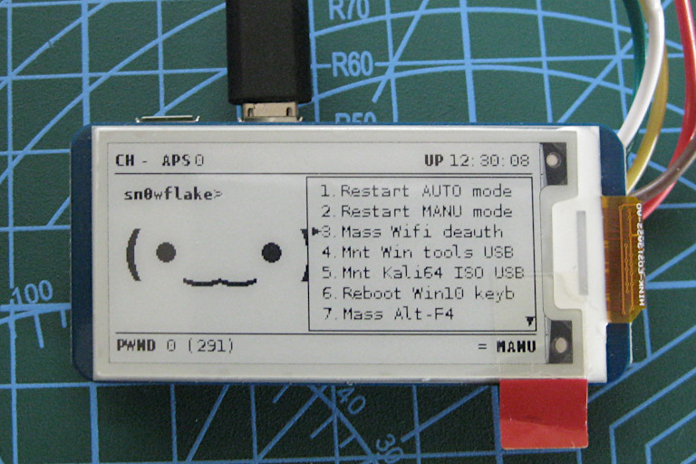

# Pwnmenu Plugin



Pwnmenu is a plugin that lets you run scripts on a Pwnagotchi using the 2.13 inch Waveshare e-paper display. You can use it to select and call scripts to extend the functionality of the host Raspberry Pi Zero W.

To do this, the Pwnmenu can be controlled with terminal commands bound to GPIO pins.

**NOTE:** Read **Current issues** at the end of this README to explain why the menu appears slow.

Some examples of scripts we have run from this are:

- making the Pwnagotchi send keystrokes via USB,
- shut down the Pwnagotchi properly using the [powerutils companion plugin](https://gitlab.com/sn0wflake/pwnagotchi-powerutils-plugin)
- or mount an ISO file on the Pwnagotchi as a USB key

## Requirements

- A Raspberry Pi Zero W (RPi0w) with Pwnagotchi installed and running.
- the [Waveshare e-paper display](https://www.waveshare.com/wiki/2.13inch_e-Paper_HAT) officially supported by the Pwnagotchi project.
- a way of copying files on to the SD card; either by an SD card reader, or SSH over USB while the RPi0w is connected to a PC or laptop.

## Optional Parts

- An active (self-oscillating) buzzer that can operate on 3v to beep when moving through menu items.

This *could* run on a Raspberry Pi Zero without the wireless (W), but we haven't tested it. Also, adding other displays to expand this plugin's compatibility is possible, although we only had access (and time) to write this plugin for the 2.13 inch e-paper display.

## How This Works

1. The file `pwnmenu.py` is loaded from the plugins directory and looks for the file `/home/pi/pwnmenu.txt`
2. The menu labels and commands to run are loaded from `pwnmenu.txt`
3. At this point, the pwnmenu plugin waits and doesn't draw anything on screen until it receives commands sent from `pwnmenucmd.py`

## Installation

There are 2 files that need to be copied, with a 3rd file written from scratch:

1. copy `pwnmenu.py` to `/usr/local/share/pwnagotchi/availaible-plugins/` (root access will be needed, but only for this file)
2. copy `pwnmenucmd.py` to `/home/pi`
3. in the folder `/home/pi` create a new plain text file called `pwnmenu.txt` with the following format:

A list of lines made up of:

```
Label text;command-to-run
```

where:

- **Label text** is the line of text to show in the menu, with a trailing semicolon (;) to end the label,
- and **command-to-run** is the command you would normally run in the terminal.

An example `/home/pi/pwnmenu.txt` file would look like this:

```
0.Back button;/home/pi/firstmenu.sh
1.Restart AUTO mode;python /home/pi/powerutilscmd.py restart-auto
2.Restart MANU mode;python /home/pi/powerutilscmd.py restart-manual
3.Mass Wifi deauth;/home/pi/masswifideauth.sh
4.Mnt Win tools USB;/home/pi/mntwintoolsusb.sh
5.Mnt Kali64 ISO USB;/home/pi/mntkalix64iso.sh
6.Reboot Win10 keyb;/home/pi/rebootwindowskeys.sh
7.Mass Alt-F4;/home/pi/altf4bomb.sh
8.Mnt Tails ISO USB;/home/pi/mnttailsiso.sh
9.Reboot AUTO;python /home/pi/powerutilscmd.py reboot-auto
10.Shutdown;python /home/pi/powerutilscmd.py shutdown
```

**Note that the first line is ignored**, and will be used in later versions to determine what the "Back" button does. It doesn't matter what you put in the `label;command` sections for the first line, **as long as that line exists**.

## Enabling the plugin

Once all 3 files above have been made you can enable the menu plugin.

Edit the pwnagotchi configuration file with `sudo nano /etc/pwnagotchi/config.toml`

To enable contrib plugins (if you haven't already) add the following line if it doesn't exist yet:

```
main.custom_plugins = "/usr/local/share/pwnagotchi/available-plugins/"
```

Also, add the following line to enable the `pwnmenu` plugin:

```
main.plugins.pwnmenu.enabled = true
```

Save with **Ctrl+o** and exit with **Ctrl+x**, then restart the pwnagotchi service with:

```
sudo systemctl pwnagotchi restart
```

After the pwnagotchi reboots, you can see if the menu plugin is working by looking for two lines (=) near the bottom-right corner. 

## Testing pwnmenu commands

With all files installed and the plugin running, you can use SSH to log in to your pwnagotchi and test the pwnmenu with the `pwnmenucmd.py` script.

Note that if the menu is not visible, running any command (except close) will show the menu.

The `/home/pi/pwnmenucmd.py` script can accept the following commands:

- `down` : Move cursor down.
- `up` : Move cursor up.
- `ok` : Run the selected menu item.
- `close` : Hide the menu.
- `back` : **UNUSED** but reserved for future functionality.

### Examples

Test with any of these commands in the `/home/pi` directory:

```
python pwnmenucmd.py up
python pwnmenucmd.py down
python pwnmenucmd.py ok
python pwnmenucmd.py close
```

## Setting up GPIO commands

Once the menu is working and you can see it on your Waveshare display, you can bind the `pwnmenucmd.py` actions to GPIO pins. Thankfully, the pwnagotchi already comes with a plugin that can handle GPIO buttons for us.

**Note that the GPIO pins I have used below might differ to the ones you connect to**.

You can enable the GPIO plugin, and the associated pins with:

`sudo nano /etc/pwnagotchi/config.toml` then add these lines (if you haven't already)

```
main.plugins.gpio_buttons.enabled = true
main.plugins.gpio_buttons.gpios.26 = "python /home/pi/pwnmenucmd.py ok"
main.plugins.gpio_buttons.gpios.19 = "python /home/pi/pwnmenucmd.py down"
main.plugins.gpio_buttons.gpios.13 = "python /home/pi/pwnmenucmd.py up"
main.plugins.gpio_buttons.gpios.6 = "python /home/pi/pwnmenucmd.py close"
```

Then restart with `sudo systemctl restart pwnagotchi`

## Optional: Setting up the active buzzer

When navigating through the menu items, we have found that sometimes button shims and GPIO buttons can send more than one button press, or none at all. By adding an active (self-oscillating) buzzer, you will be able to hear if a menu command has been sent, as well as how many times it has.

To do this, the positive lead of active buzzer is connected to an available GPIO pin, while the other lead is connected to ground. The GPIO pin will put out 3.3v, and as long as the buzzer used is within the operating voltage, a resistor shouldn't be needed. (We tested one with a 3 to 9 volt operating range with success.)

With the hardware set up, edit the `/home/pi/pwnmenucmd.py` script file:

1. Uncomment the lines `import RPi.GPIO as GPIO` and `from time import sleep` near the top of the script.
2. Change the line `buzzerpin = 0` to match the GPIO the positive (+) lead of the buzzer is connected to. (Ours is `buzzerpin = 5` to use GPIO #5, although yours may be different)
3. The buzzer should be usable straight away if the pwnmenu has already been set up and restarted.

## Current issues

pwnmenucmd simply listens for data on port 6789 without authentication of any kind. This could easily be triggered by anything that can send data to that port, whether it is accidentally or malicious.

### Regarding the slow performance...

I don't completely understand how the Waveshare v2 screen is redrawn, but I'm looking in to the code to see how partial screen updates work. Current UI changes in pwnmenu are made with the call `view.ROOT.update(force=True)` which appears to refresh the entire screen. This can be harmful since a fast refresh rate or too many screen redraws can damage the e-paper display over time.

To be on the cautious side, **a 2-second delay is added after any keypress**. While this can make navigating the menu appear sluggish, the menu cursor is still being moved around "off screen" and you can still press/activate/run OK to select menu items regardless of UI updates.

As stated by evilsocket himself, in response to the screen refresh plugin: [https://github.com/evilsocket/pwnagotchi/issues/555#issuecomment-551804755](https://github.com/evilsocket/pwnagotchi/issues/555#issuecomment-551804755)

> not according to months of testing and our customized codebase, which is different than their examples and sdk"

## License

This plugin is released under the GPLv3 License

```
pwnmenu - An interactive menu plugin for the pwnagotchi.
Copyright (C) 2024  Sam "sn0wflake" Allen

This program is free software: you can redistribute it and/or modify
it under the terms of the GNU General Public License as published by
the Free Software Foundation, either version 3 of the License, or
(at your option) any later version.

This program is distributed in the hope that it will be useful,
but WITHOUT ANY WARRANTY; without even the implied warranty of
MERCHANTABILITY or FITNESS FOR A PARTICULAR PURPOSE.  See the
GNU General Public License for more details.

You should have received a copy of the GNU General Public License
along with this program.  If not, see <https://www.gnu.org/licenses/>.
```
